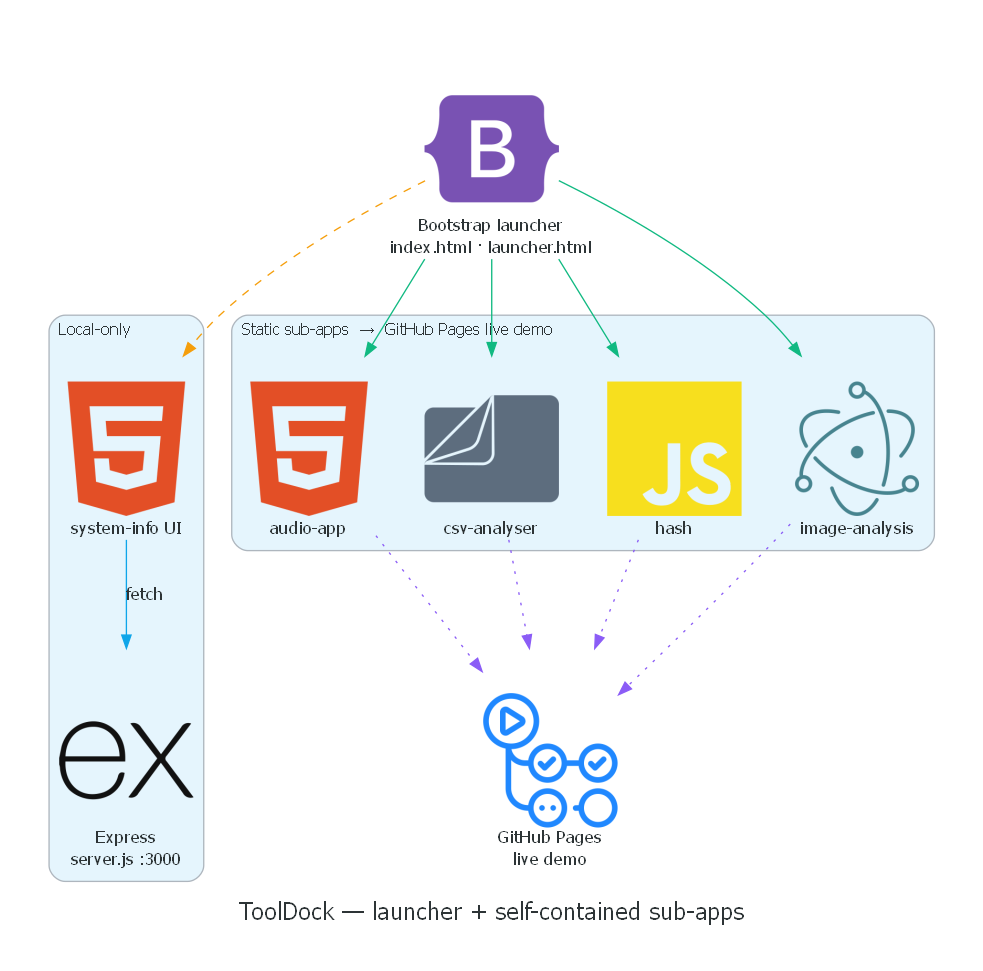

# ToolDock

A small **dashboard that launches a set of mini utility apps**. `index.html` is a
Bootstrap landing page that links out to self-contained tools, each living in its
own folder under `subapps/`.

**🌐 Live demo:** <https://kh1606.github.io/tooldock/> — the four in-browser tools
(audio, CSV analyser, hashing, image analysis). `system-info` needs its Express
backend, so it's not part of the static demo.




*Rendered from [`docs/howitworks.py`](docs/howitworks.py) (Python `diagrams` library).*

**Stack:** HTML/CSS/JS · Electron-style renderer scripts · Node/Express (for `system-info`)

## The tools

| App | Folder | What it does |
|-----|--------|--------------|
| Audio app | `subapps/audio-app` | Audio playback / processing UI |
| CSV analyser | `subapps/csv-analyser` | Load and inspect CSV files in the browser |
| Hash | `subapps/hash` | Compute hashes for text / files |
| Image analysis | `subapps/image-analysis-electron` | Inspect image metadata / properties |
| System info | `subapps/system-info` | Show system information + file upload (Express backend) |

## Run

Most tools are static pages — open `launcher.html` (or a tool's `index.html`) in a
browser, or load it as an Electron renderer.

`system-info` has a small Express backend:

```bash
cd subapps/system-info
npm install
node server.js        # serves on http://localhost:3000
```

> This is an early prototype suite — the tools are independent and not all polished.

## License

MIT — see [LICENSE](LICENSE).
